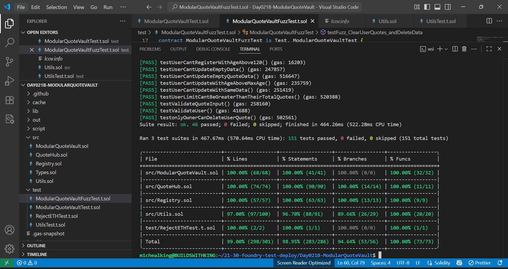

# ✍️ ModularQuoteVault (Day 21 Project B - 30 Days Of Solidity)

A fully modular, test-driven Quote Vault which allows users to register, update, retrieve and delete their data and quotes. This contract ensures only registered users can store, update, retrieve, and delete quotes while following the Check-Effects-Interations (CEI) pattern for ETH transfers with a non-reentrant modifier. Foundry tested with 99% coverage. 

## 📝 Project Summary
This project demonstrates core Solidity principles, including:

- Structs
- Mappings
- Custom Errors
- Events
- Modifiers and helper functions
- Access Control (onlyOwner, isActive)
- Ownership Transfer & renouncement
- Receive & Fallback functions
- ETH transfer Logic
- Reentrancy guard (nonReentrant)

## 🔥 Features

- Store user data (fullname, age, gender, email, skill)
- Update user data
- Retrieve user data
- Retrieve global data(by owner)
- Delete personal data
- Delete global data (by owner)
- Store quotes (author, quote, category, source, personal note)
- Update quotes
- Retrieve quotes
- Retrieve global quotes (by owner)
- Delete quotes
- Delete global quotes (by owner)


>Note: Once ownership is renounced, all owner-only actions are locked(the owner is set to the zero address). 

## 📂 Project Structure
```
|── Day021B-ModularQuoteVault      #Project Folder
|
|   ├── script
|   ├── DeployModularQuoteVault.s.sol    
|
├── src
│   ├── Types.sol                 # Centralized type definitions (structs, enums, errors)
│   ├── Utils.sol                 # Internal helper functions, modifiers, events, ETH logic, etc
|   |── Registry.sol              # Handles users data CRUD operation
|   |── QuoteHub.sol              # Handles Quotes CRUD operation
│   ├── ModularQuoteVault.sol     # Main contract with CRUD logic for user data & qoutes. 
│  
│
└── test
|   ├── ModularQuoteVaultTest.t.sol # Full test suite for Registry, QuoteHub and ModularQuoteVault. 
|   |── ModularQuoteVaultFuzzTest.t.sol  # Fuzz test for deleteData (_clearUserData).
|   └── UtilsTest.t.sol             # Utils test suite. 
|   ├── RejectETH.t.sol             # Rejects ETH to simulate failed transfers.
|
|── ReadMe.md                          # This file.


```

## 💻 Contract Deployment

- Network: Sepolia Testnet
- Contract Address: 0x9B6179162bbEbf9ECe43B12Cb803723619c98E75
- Status: [Verified](https://sepolia.etherscan.io/address/0x9b6179162bbebf9ece43b12cb803723619c98e75) ✅

## 🛠 Tools Used 
- Language: Solidity `0.8.30`
- IDE: [Remix](https://remix.ethereum.org/) & Visual Studio Code
- Version Control: Git + GitHub (SSH)
- FrameWork: Foundry

## 🧪 Testing
This project includes full unit and fuzz test coverage:
- User data storage, update, retrieval, and deletion
- Quote storage, update, retrieval and deletion
- Custom error reverts
- Events emissions
- Owner-only access restrictions
- ETH deposit and withdrawals
- Receive and fallback behaviour

## Coverage: 99%


## 👨‍💻 Local Development
To run this project locally:
- Clone this repo
- Install Foundry
- Run:

```
forge install
```
 
### Compile project
```
forge compile
forge build
```

### Run tests
```
forge test -vvv
```

### Check Coverage with:
```
forge coverge
```

### Gas snapshot
```
forge snapshot
```

## Deployment
Deployed via Foundry script:

```
forge script script/DeployModularQuoteVault.s.sol --rpc-url $SEPOLIA_RPC_URL --private-key $PRIVATE_KEY --broadcast --verify
```
> Note: Optimizer enabled in foundry.toml (optimizer = true, runs = 200) to reduce bytescode size. 

## 🪪 License
MIT License - Feel free to fork, learn, remix and build with it. 

## 👨‍💻 Author

Built with 🔥 by [Michealking](github.com/BuildsWithKing)

Part of my [30 Days of Solidity Challenge](https://github.com/BuildsWithKing/30-days-solidity-challenge)

## ✍️ Project Journey
I dedicated 13 intense days building this project. I refactored, debugged, got stucked, felt frustrated at times but didnt give up, i kept reminding myself that i didnt come this far jsut to quit now.
I gave it everything, and i'm so proud of this gem. it proves one thing **Consistency builds mastery** and **Mastery is the goal**. 

--- 
### Kindly give credit if this inspired your learning journey.
---

✅ Day 21 Project B Completed!