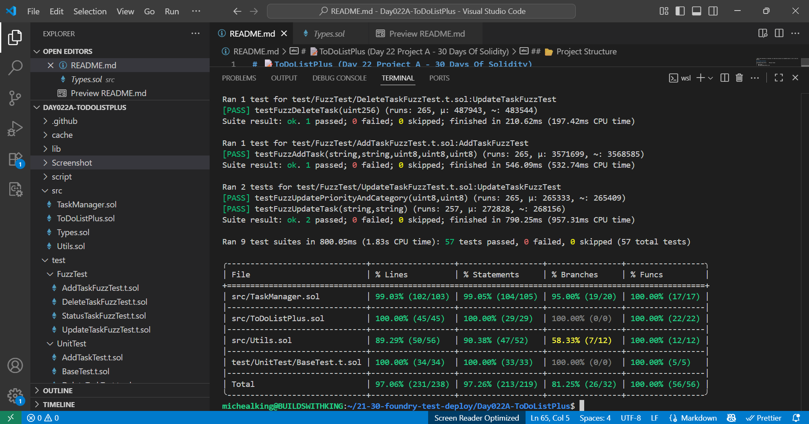

 
 


# 📝ToDoListPlus (Day 22 Project A - 30 Days Of Solidity)

This modular smart contract allows users add, update, retrieve and delete tasks with title, description, priority, category and a due date. User can also reschedule, defer, recur and cancel any tasks of their choice. 

## ✅ Features 
- Store task (title, description, priority, category and due date)
- Update task 
- Update status
- Update priority
- Update Category
- Retrieve task
- Mark task as completed
- Cancel task
- Reschedule task
- Recur task
- Defer task
- Delete task
- Retrieve task status
- Retrieve task priority
- Retrieve task category

## ✍️ Project Summary

This project demonstrates core Solidity principles, including:

- Structs
- Mappings
- Custom errors
- Events
- Modifiers and helper functions
- Access Control (onlyOwner, isActive)
- Ownership Transfer & renouncement
- Receive & Fallback functions
- Reentrancy guard (nonReentrant)

> Note: Once ownership is renounced, all owner-only actions are locked(the owner is set to the zero address)

## 📂 Project Structure 
```
|── Day022A-ToDoListPlus      #Project Folder
|
|   ├── Script
|   ├── DeployToDoListPlus.s.sol    
|
├── src
│   ├── Types.sol               # Centralized type definitions (variables, structs, enums, mappings)
│   ├── Utils.sol               # Internal helper functions, modifiers, events, receive and fallback.
|   |── TaskManager.sol          # Handles Task CRUD operation (Internally)
│   ├── ToDoListPlus.sol        # Main contract with CRUD task logic (Externally). 
│  
│
└── test
|   ├── UnitTest
|           |── BaseTest.t.sol     # Main test contract with variables, modifiers and setUp function. 
|           |── AddTaskTest.t.sol   # Unit test contract for add task function. 
|           |── StatusTaskTest.t.sol # Unit test contract for status, priority and category. 
|           |── UpdateTaskTest.t.sol # Unit test contract for all update functions.
|           |── DeleteTaskTest.t.sol # Unit test contract for all delete functions. 
|           |── UtilsTest.t.sol     # Utils test contract. 
|    |──FuzzTest
|           |── AddTaskFuzzTest.t.sol   # Fuzz test contract for add task function. 
|           |── StatusTaskFuzzTest.t.sol # Fuzz test contract for status, priority and category. 
|           |── UpdateTaskFuzzTest.t.sol # Fuzz test contract for all update functions.
|           |── DeleteTaskFuzzTest.t.sol # Fuzz test contract for all delete functions.  
|   
|── ReadMe.md                          # This file.
```

## 🧪 Usage 

### Run on [Remix](https://remix.ethereum.org/)

```solidity
addMyTask(
    "Day022A ToDoListPlus",
            "Spend Minimum of 6 hours daily on Day022 project A",
            3,
            2,
            1765510855
);
```

```solidity
updateMyTaskTitle(
    0,
    "Day022A ModularToDoList"
);
```

```solidity
updateMyTaskDescription(
    0,
    "Learn Fuzz testing"
);
```

```solidity
updateMyTaskPriority(
    0,
    4
);
```

```solidity
markMyTaskAsCompleted(
    0
);
```

```solidity
deleteMyTask(
    0
);
```

## 💻 Contract Deployment

- Network: Sepolia Testnet
- Contract Address: 0x8564FC27799605072f80d4469CeF3b09C889099d
- Status: [Verified](https://sepolia.etherscan.io/address/0x8564FC27799605072f80d4469CeF3b09C889099d) ✅

## 🛠 Tools Used 
- Language: Solidity `0.8.30`
- IDE: [Remix](https://remix.ethereum.org/) & Visual Studio Code
- Version Control: Git + GitHub (SSH)
- FrameWork: Foundry

## 🧪 Testing
This project includes full unit and fuzz test coverage:
- Task storage, update, retrieval, and deletion
- Custom error reverts
- Events emissions
- Owner-only access restrictions
- Receive and fallback behaviour

## Coverage: 97.06%


## 👨‍💻 Local Development
To run this project locally:
- Clone this repo
- Install Foundry
- Run:

```
forge install
```
 
### Compile project
```
forge compile
forge build
```

### Run tests
```
forge test -vvv
```

### Check Coverage with:
```
forge coverage
```

### Gas snapshot
```
forge snapshot
```

## Deployment
Deployed via Foundry script:

```
forge script script/DeployToDoListPlus.s.sol --rpc-url $SEPOLIA_RPC_URL --private-key $PRIVATE_KEY --broadcast --verify
```
> Note: Optimizer enabled in foundry.toml (optimizer = true, runs = 200) to reduce bytecode size. 

## 🪪 License
MIT License - Feel free to fork, learn, remix and build with it. 

## 👨‍💻 Author

Built with 🔥 by [Michealking](github.com/BuildsWithKing)

Part of my [30 Days of Solidity Challenge](https://github.com/BuildsWithKing/30-days-solidity-challenge)

## ✍️ Project Journey

During development, I encountered the `stack too deep` error which I resolved by implementing an internal helper function (_buildTask).

--- 
### Kindly give credit if this inspired your learning journey.
---

✅ Day 22 Project A Completed!
