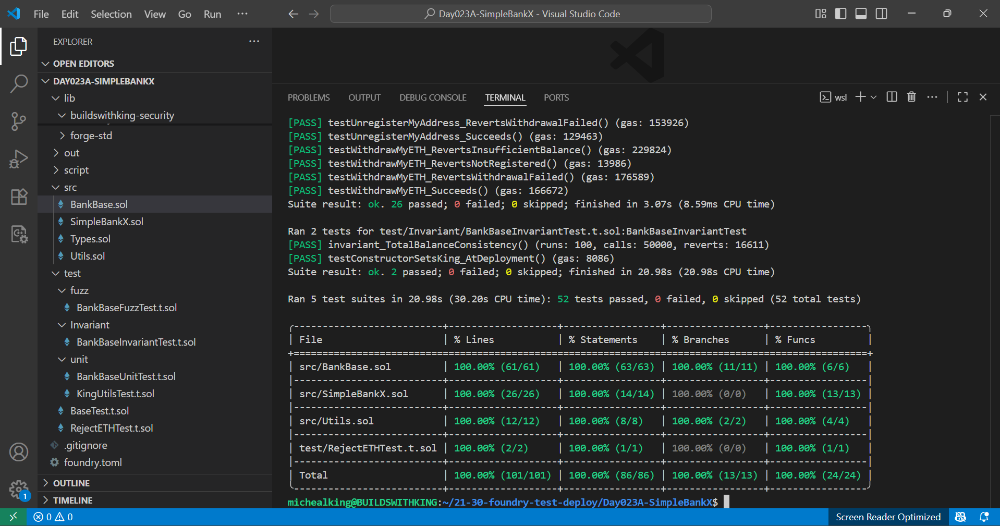

# 🏦 SimpleBankX (Day 23 Project A - 30 Days Of Solidity) 👑

SimpleBankX is a modular Solidity smart contract that lets users **register, deposit, withdraw, transfer ETH, and track balances** with full refund support on unregistration.  
The King (owner) can manage global settings and view registered users.  

This project demonstrates secure Solidity development practices including **custom errors, modifiers, reentrancy protection, access control, pausing, and robust ETH transfer handling**.

## 📑Table Of Contents
- [SimpleBankX (Day 23 Project A - 30 Days Of Solidity)](https://github.com/BuildsWithKing/21-30-foundry-test-deploy/tree/main/Day023A-SimpleBankX#simplebankx-day-23-project-a---30-days-of-solidity-)
- [Features](https://github.com/BuildsWithKing/21-30-foundry-test-deploy/tree/main/Day023A-SimpleBankX#-features)
- [Project Summary](https://github.com/BuildsWithKing/21-30-foundry-test-deploy/tree/main/Day023A-SimpleBankX#%EF%B8%8F-project-summary)
- [Project Structure](https://github.com/BuildsWithKing/21-30-foundry-test-deploy/tree/main/Day023A-SimpleBankX#-project-structure)
- [Usage](https://github.com/BuildsWithKing/21-30-foundry-test-deploy/tree/main/Day023A-SimpleBankX#-usage)
- [Contract Deployment](https://github.com/BuildsWithKing/21-30-foundry-test-deploy/tree/main/Day023A-SimpleBankX#-contract-deployment)
- [Tools Used](https://github.com/BuildsWithKing/21-30-foundry-test-deploy/tree/main/Day023A-SimpleBankX#-tools-used)
- [Testing](https://github.com/BuildsWithKing/21-30-foundry-test-deploy/tree/main/Day023A-SimpleBankX#-testing)
- [Local Development](https://github.com/BuildsWithKing/21-30-foundry-test-deploy/tree/main/Day023A-SimpleBankX#%E2%80%8D-local-development)
- [Deployment](https://github.com/BuildsWithKing/21-30-foundry-test-deploy/tree/main/Day023A-SimpleBankX#deployment)
- [License](https://github.com/BuildsWithKing/21-30-foundry-test-deploy/tree/main/Day023A-SimpleBankX#-license)
- [Author](https://github.com/BuildsWithKing/21-30-foundry-test-deploy/tree/main/Day023A-SimpleBankX#%E2%80%8D-author)
- [Project Journey](https://github.com/BuildsWithKing/21-30-foundry-test-deploy/tree/main/Day023A-SimpleBankX#%EF%B8%8F-project-journey)

## Features 
- Users
  - RegisterMyAddress
  - UnregisterMyAddress
  - DepositMyETH
  - WithdrawMyETH
  - TransferETH
  - MyRegistrationStatus
  - CheckUserRegistrationStatus
  - ActiveUsersCount
  - LifetimeUsersCount
  - MyBalance
  - BankBalance

- King
  - GetRegisteredUsers

## ✍️ Project Summary
This project demonstrates core Solidity principles, including:

- Structs
- Mappings
- Custom errors
- Events
- Modifiers and helper functions
- Access Control (nonReentrant, onlyRegistered, onlyKing and whenActive)
- Ownership Transfer & renouncement
- Pause and Activate contract
- Receive & Fallback functions
- Kingable security module
- Reentrancy guard

> *Note: Once kingship is renounced, all king-only actions are locked (the king is set to the zero address)*

## 📂 Project Structure

```
|── Day023A-SimpleBankX      #Project Folder
|
|   ├── Script
|   ├── DeploySimpleBankX.s.sol    
|
├── src
│   ├── Types.sol           # Centralized type definitions (variables, structs, enums, mappings)
│   ├── Utils.sol           # Custom errors, events, modifiers, Internal helper functions, receive and fallback.
|   |── BankBase.sol        # Handles users and king CRUD operation (Internally)
│   ├── SimpleBankX.sol    # Main contract with users and king CRUD logic (Externally). 
│  
│
└── test
|   ├── UnitTest
|           |── BankBaseUnitTest.t.sol      # Test contract for users write and read functions. 
|           |── KingUtilsTest.t.sol     # Unit test contract for King's write, read, receive and fallback function. 
|     
|          
|    |──FuzzTest
|           |── BankBaseFuzzTest.t.sol   # Fuzz test contract for SimpleBankX contract.  
|
|    |── Invariant
|           |── BankBaseInvariantTest.t.sol  # Invariant test to ensure contract balance is consistent. 
|
|
|   |── BaseTest.t.sol      # Main test contract with variables, modifiers, setup function and constructor test. 
|   |── RejectETHTest.t.sol  # Unit test contract to simulate failed ETH withdrawal. 
|   
|── ReadMe.md                          # This file.
```


## 🧪 Usage
### Step 1: Clone repo on [Remix](https://remix.ethereum.org/) 

### Step 2: Deploy contract with the first address on remix as king. See example below 👇 

```soldity
0x5B38Da6a701c568545dCfcB03FcB875f56beddC4
```

### Step 3: Register with any of the addresses on remix.
```solidity
registerMyAddress();
```

### Step 4: Deposit ETH with a registered address. (Input value on the remix deploy & run transactions).
```solidity
depositMyETH();
```

### Step 5: Transfer ETH from a registered sender to another registered address.
```solidity
transferETH(
    0xAb8483F64d9C6d1EcF9b849Ae677dD3315835cb2,
    1
);
```

### Step 6: Unregister any registered address.
```solidity
unregisterMyAddress();
```

### Step 7: Check user registration status.
```solidity
checkUserRegistrationStatus(
    0xAb8483F64d9C6d1EcF9b849Ae677dD3315835cb2
);
```
### Step 8: Use king's address to pause contract (Only king can pause/activate).
```solidity
pauseContract();
```

## 💻 Contract Deployment

- Network: Sepolia Testnet
- Contract Address: 0xF103FB877bbD54f5fd20426F2c194d9276d1e269
- [Verified](https://sepolia.etherscan.io/address/0xF103FB877bbD54f5fd20426F2c194d9276d1e269) ✅

## 🛠 Tools Used 
- Language: Solidity `0.8.30`
- IDE: [Remix](https://remix.ethereum.org/) & Visual Studio Code
- FrameWork: Foundry
- Version Control: Git + GitHub (SSH)

## 🧪 Testing
This project includes full unit, fuzz and invariant test coverage:
- Register, unregister, deposit, withdraw, transfer ETH, etc. 
- Custom error reverts
- Events emissions
- King-only access restrictions
- Receive and fallback behaviour

## Coverage: 100%


## 👨‍💻 Local Development
To run this project locally:
- Clone this repo
- Install Foundry
- Run:

```
forge install
```
 
### Compile project
```
forge compile 
forge build
```

### Run tests
```
forge test
```

### Check Coverage with:
```
forge coverage
```

### Gas snapshot
```
forge snapshot
```

## Deployment
Deployed via Foundry script:

```
forge script script/DeploySimpleBankX.s.sol --rpc-url $SEPOLIA_RPC_URL --private-key $PRIVATE_KEY --broadcast --verify
```
> Note: Remapping enabled in foundry.toml 
```
remappings = [
    "buildswithking-security/=lib/buildswithking-security/contracts/access/"
]
```

## 🪪 License
MIT License - Feel free to fork, learn, remix and build with it. 

## 👨‍💻 Author

Built with 🔥 by [Michealking](github.com/BuildsWithKing)

Part of my [30 Days of Solidity Challenge](https://github.com/BuildsWithKing/30-days-solidity-challenge)

## ✍️ Project Journey

While building SimpleBankX, I explored the challenge of safely refunding balances on unregistration. I learned how gas-heavy fallbacks can cause refund failures and implemented robust revert handling. This project deepened my understanding of Solidity access control, modular design, and secure ETH transfers.

--- 
### If this project helps you, consider giving a ⭐ on GitHub — it motivates and supports my open-source work.
---

**✅ Day 23 Project A Completed!**

