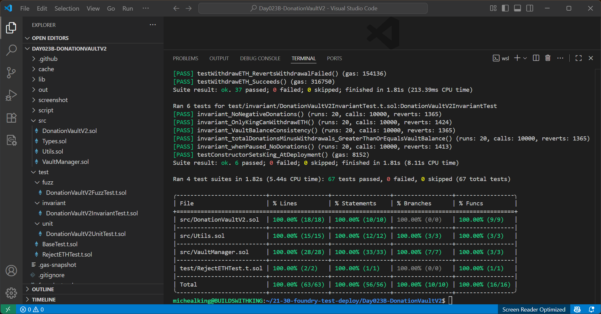

# 💓 DonationVaultV2 (Day 23 Project B - 30 Days Of Solidity) 👑

A modular vault contract built with security in mind, allows donors to donate ETH, view their donation status and balance, total ETH donated, and vault balance. Only King (contract deployer) can safely withdraw ETH donated, secured with reentrancy guard. 

## 📑Table Of Contents
- [DonationVaultV2 (Day 23 Project B - 30 Days Of Solidity)](https://github.com/BuildsWithKing/21-30-foundry-test-deploy/tree/main/Day023B-DonationVaultV2#donationvaultv2-day-23-project-b---30-days-of-solidity-)
- [Features](https://github.com/BuildsWithKing/21-30-foundry-test-deploy/tree/main/Day023B-DonationVaultV2#-features)
- [Project Summary](https://github.com/BuildsWithKing/21-30-foundry-test-deploy/tree/main/Day023B-DonationVaultV2#%EF%B8%8F-project-summary)
- [Project Structure](https://github.com/BuildsWithKing/21-30-foundry-test-deploy/tree/main/Day023B-DonationVaultV2#-project-structure)
- [Usage](https://github.com/BuildsWithKing/21-30-foundry-test-deploy/tree/main/Day023B-DonationVaultV2#-usage)
- [Contract Deployment](https://github.com/BuildsWithKing/21-30-foundry-test-deploy/tree/main/Day023B-DonationVaultV2#-contract-deployment)
- [Tools Used](https://github.com/BuildsWithKing/21-30-foundry-test-deploy/tree/main/Day023B-DonationVaultV2#-tools-used)
- [Testing](https://github.com/BuildsWithKing/21-30-foundry-test-deploy/tree/main/Day023B-DonationVaultV2#-testing)
- [Local Development](https://github.com/BuildsWithKing/21-30-foundry-test-deploy/tree/main/Day023B-DonationVaultV2#%E2%80%8D-local-development)
- [Deployment](https://github.com/BuildsWithKing/21-30-foundry-test-deploy/tree/main/Day023B-DonationVaultV2#deployment)
- [License](https://github.com/BuildsWithKing/21-30-foundry-test-deploy/tree/main/Day023B-DonationVaultV2#-license)
- [Author](https://github.com/BuildsWithKing/21-30-foundry-test-deploy/tree/main/Day023B-DonationVaultV2#%E2%80%8D-author)

## ✅ Features 
- Donors
  - DonateETH
  - LifetimeDonorsCount
  - TotalETHDonated
  - ViewDonorDonationStatus
  - MyDonation
  - ViewDonorBalance
  - VaultBalance
- King
  - WithdrawETH
  - GetDonorsAddresses
  
## ✍️ Project Summary
DonationVaultV2 builds on the previous DonationVault architecture with testing coverage, modular design, and invariant safety guarantees.

This project demonstrates core Solidity principles, including:

- Structs
- Mappings
- Custom errors
- Events
- Modifiers and helper functions
- Access Control (nonReentrant, onlyKing and whenActive)
- Pause and Activate contract
- Receive and Fallback functions
- Kingable security module
- Reentrancy guard

> Note: Donors can't donate ETH, whenever the king pauses the contract. 

## 📂 Project Structure

```
|── Day023B-DonationVaultV2      # Project Folder
|
|   ├── Script
|   ├── DeployDonationVaultV2.s.sol    
|
├── src
│   ├── Types.sol           # Centralized type definitions (variables, mappings & events)
│   ├── Utils.sol           # Custom errors, Internal helper functions, receive and fallback.
|   |── VaultManager.sol        # Handles donors and king CRUD operation (Internally)
│   ├── DonationVaultV2.sol    # Main contract with donors and king CRUD logic (Externally). 
│  
│
└── test
|    |──fuzz
|           |── DonationVaultV2FuzzTest.t.sol   # Fuzz test contract for donors and king's write and read functions.
|    |── Invariant
|           |── DonationVaultV2InvariantTest.t.sol  # Invariant test contract for donors and king's write and read functions. 
|
|   ├── unit
|           |── DonationVaultV2UnitTest.t.sol   # Unit test contract for donors and king's write and read functions. 
|     
|
|   |── BaseTest.t.sol      # Main test contract with variables, setup function, internal helper function and constructor test. 
|   |── RejectETHTest.t.sol  # Test contract to simulate failed ETH withdrawal. 
|   
|── README.md                          # This file.
```

## 🧪 Usage
### Step 1: Clone repo on [Remix](https://remix.ethereum.org/) 

### Step 2: Deploy contract with the first address on remix as king. See example below 👇 

```soldity
0x5B38Da6a701c568545dCfcB03FcB875f56beddC4
```

### Step 3: Donate with any of the addresses on remix.
```solidity
donateETH();
```

### Step 4: View lifetime donors count. 
```solidity
lifetimeDonorsCount();
```

### Step 5: View total ETH donated. 
```solidity
totalETHDonated();
```
### Step 6: View donor donation status.
```solidity
viewDonorDonationStatus(0xAb8483F64d9C6d1EcF9b849Ae677dD3315835cb2);
```

### Step 7: My donation. 
```solidity
myDonation();
```

### Step 8: View donor balance. 
```solidity
viewDonorBalance(0xAb8483F64d9C6d1EcF9b849Ae677dD3315835cb2);
```

### Step 9: View vault balance.
```solidity
vaultBalance();
```

### Step 10: Withdraw ETH as king (Use the king's address) 
```solidity
withdrawETH(0xAb8483F64d9C6d1EcF9b849Ae677dD3315835cb2, 1000000000000000000);
```

### Step 11: Get donors addresses as king (Use the king's address). 
```solidity
getDonorsAddresses(0, 2);
```

### Step 12: Pause contract as king (Use the king's address).
```solidity
pauseContract();
```

## 💻 Contract Deployment

- Network: Sepolia Testnet
- Contract Address: 0xF65139354c70a7bC1F00B7Cea430DDa03BE2b78e
- [Verified](https://sepolia.etherscan.io/address/0xF65139354c70a7bC1F00B7Cea430DDa03BE2b78e) ✅

## 🛠 Tools Used 
- Language: Solidity `0.8.30`
- IDE: [Remix](https://remix.ethereum.org/) & Visual Studio Code
- Framework: Foundry
- Version Control: Git + GitHub (SSH)

## 🧪 Testing
This project includes full unit, fuzz and invariant test coverage:
- donateETH, withdrawETH, getDonorsAddresses(paginated), etc. 
- Custom error reverts
- Events emissions
- King-only access restrictions
- Receive and fallback behaviour

## Coverage: 100%
Here is the current test coverage. 


## 👨‍💻 Local Development
To run this project locally:
- Clone this repo
- Install Foundry
- Run:

```
forge install
```
 
### Compile project
```
forge compile 
forge build
```

### Run tests
```
forge test
```

### Check Coverage with:
```
forge coverage
```

### Gas snapshot
```
forge snapshot
```

## Deployment
Deployed via Foundry script:

```
forge script script/DeployDonationVaultV2.s.sol --rpc-url $SEPOLIA_RPC_URL --private-key $PRIVATE_KEY --broadcast --verify
```
> Note: Remapping enabled in foundry.toml 
```
remappings = [
    "buildswithking-security/=lib/buildswithking-security/contracts/access/"
]
```

> Built with KingPausable and ReentrancyGuard modules from [buildswithking-security](https://github.com/BuildsWithKing/buildswithking-security) suite.


## 🪪 License
MIT License - Feel free to fork, learn, remix and build with it. 

## 👨‍💻 Author

Built with 🔥 by [Michealking](github.com/BuildsWithKing)

Part of my [30 Days of Solidity Challenge](https://github.com/BuildsWithKing/30-days-solidity-challenge)

--- 
### If this project helps you, consider giving a ⭐ on GitHub — it motivates and supports my open-source work.
---

**✅ Day 23 Project B Completed!**
