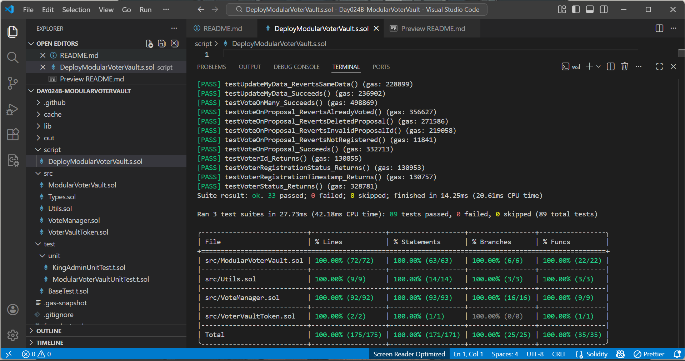

# 🗳️ ModularVoterVault — Modular On-chain Voting & Governance System (Day 24 Project B - 30 Days Of Solidity Challenge) 👑

A modular, secure on-chain voting system that allows voters to register, vote on a proposal with the `VVT` token, and revoke votes. Only the king and admin can create and delete proposals. Full access control between voters, king, and admin ensures safety and governance integrity. Layered architecture includes `ModularVoterVault`, `VoteManager`, `Utils`, and `Types`, with **100% test coverage**.

## Table Of Contents
- [🗳️ ModularVoterVault — Modular On-chain Voting \& Governance System (Day 24 Project B - 30 Days Of Solidity Challenge) 👑](#️-modularvotervault--modular-on-chain-voting--governance-system-day-24-project-b---30-days-of-solidity-challenge-)
  - [Table Of Contents](#table-of-contents)
  - [Features](#features)
  - [Project Summary](#project-summary)
  - [Project Structure](#project-structure)
  - [Usage](#usage)
    - [Step 1: Clone repo on Remix](#step-1-clone-repo-on-remix)
    - [Step 2: Deploy the token contract, with the king's address and a total supply.](#step-2-deploy-the-token-contract-with-the-kings-address-and-a-total-supply)
    - [Step 3: Transfer Token to voters address.](#step-3-transfer-token-to-voters-address)
    - [Step 4: Deploy `ModularVoterVault` contract with first address as King, second as Admin, paste the token address and per vote fee.](#step-4-deploy-modularvotervault-contract-with-first-address-as-king-second-as-admin-paste-the-token-address-and-per-vote-fee)
    - [Step 5: Register as a voter](#step-5-register-as-a-voter)
    - [Step 6: Create a Proposal with the admin or king's address and view the proposal](#step-6-create-a-proposal-with-the-admin-or-kings-address-and-view-the-proposal)
    - [Step 7: Approve `ModularVoterVault` contract address to spend a specific amount of token on your behalf.](#step-7-approve-modularvotervault-contract-address-to-spend-a-specific-amount-of-token-on-your-behalf)
    - [Step 8: Vote on proposals](#step-8-vote-on-proposals)
    - [Step 9: Revoke votes](#step-9-revoke-votes)
    - [Step 10: Admin/KING governance actions](#step-10-adminking-governance-actions)
  - [Contract Deployment](#contract-deployment)
  - [Tools Used](#tools-used)
  - [Testing](#testing)
  - [Coverage: 100%](#coverage-100)
  - [Local Development](#local-development)
    - [Compile](#compile)
    - [Run tests](#run-tests)
    - [Check coverage](#check-coverage)
    - [Gas snapshot](#gas-snapshot)
  - [Deployment](#deployment)
  - [License](#license)
  - [Author](#author)

## Features
- Voters
  - RegisterMyData
  - UpdateMyData
  - UnregisterMyData
  - VoteOnMany
  - RevokeMyVote
  - RevokeOnMany
  - VoteOnProposal
  - MyData
  - VoterId
  - ProposalData
  - VoterRegistrationStatus
  - VoterRegistrationTimestamp
  - VoterStatus
  - ContractTokenBalance

- King
  - AssignAdmin
  - WithdrawToken
- King and Admin
  - CreateProposal
  - DeleteProposal
  - VoterData
  - RegisteredVoters
  - VotersAddresses

## Project Summary
ModularVoterVault is a fully-tested modular voting system extending `VoteManager` with secure access control via King/Admin roles.

This project demonstrates core Solidity principles, including:

- Structs
- Mappings
- Custom errors
- Events
- Modifiers and helper functions
- Access Control (`onlyKing`, `whenActive`, `onlyRole(ADMIN_ROLE)`, `OnlyRegistered` , `OnlyValidId`)
- KingClaimMistakenETH: Accepts ETH transfers and allows voters claim back their mistakenly sent ETH. 
- Proposal creation, deletion, and voting.
- Vote revocation
- Admin and King governance
- Token withdrawal functionality

> Note: Only registered voters with `VVT` token can vote on proposals. Admin and King have extended governance rights.

## Project Structure
```
|── Day024-ModularVoterVault                  # Project Folder
|
|   ├── script
|       ├── DeployModularVoterVault.s.sol     # Foundry deployment script
|
├── src
|   ├── VoterVaultToken.sol            # VVT Erc20 contract.  
│   ├── Types.sol                      # Variables, structs, mapping, and events.
│   ├── Utils.sol                      # Custom errors, modifier, and internal helper function.
│   ├── VoteManager.sol                 # Internal logic for registration, updates, vote, revoke vote, etc.
│   ├── ModularVoterVault.sol           # Main voter-facing contract (extends VoteManager)
│
└── test
|   ├── unit
|   |   ├── ModularVoterVaultUnitTest.t.sol   # Unit tests for voter read/write functions
|   |   ├── KingAdminUnitTest.t.sol    # Unit tests for the king and admin read/write functions
|
|   ├── BaseTest.t.sol                 # Shared setup, variables, and helper functions
|
|── README.md                          # This file
```
## Usage

### Step 1: Clone repo on [Remix](https://remix.ethereum.org/) 

Click on `Import files with HTTPS` and paste:
```
https://github.com/BuildsWithKing/21-30-foundry-test-deploy/tree/main/Day024B-ModularVoterVault
```
### Step 2: Deploy the token contract, with the king's address and a total supply. 
Example:
```
0x5B38Da6a701c568545dCfcB03FcB875f56beddC4, 100000000
```
### Step 3: Transfer Token to voters address. 
```
transfer(0x4B20993Bc481177ec7E8f571ceCaE8A9e22C02db);
``` 

### Step 4: Deploy `ModularVoterVault` contract with first address as King, second as Admin, paste the token address and per vote fee.
Example:
```
0x5B38Da6a701c568545dCfcB03FcB875f56beddC4, 0xAb8483F64d9C6d1EcF9b849Ae677dD3315835cb2, tokenContractAddress, 50. 
```
### Step 5: Register as a voter
```
registerMyData(0x1220e0b5c7a9f8d6e4c3b2a1f0e9d8c7b6a5d4c3b2a1f0e9d8c7b6a5d4c3b2a1);
```
### Step 6: Create a Proposal with the admin or king's address and view the proposal
```
createProposal(0xabcdef1234567890abcdef1234567890abcdef1234567890abcdef4435835878);
``` 
```
proposalData(1)
```
### Step 7: Approve `ModularVoterVault` contract address to spend a specific amount of token on your behalf. 
```
approve(0x613B45ECEba3E3BBa3DdA761E6bF9E1D7C942b5F, 500);
```
### Step 8: Vote on proposals 
```
voteOnProposal(1) 
```
```
voteOnMany([1,2,3])
```
### Step 9: Revoke votes
```
revokeMyVote(1) 
```
```
revokeOnMany([1,2])
```
### Step 10: Admin/KING governance actions
```
deleteProposal(1) 
```
```
voterData(voterAddress)
``` 
```
registeredVoters(startId, endId)
```
``` 
votersAddresses(proposalId, startId, endId) 
```
```
withdrawToken(0x5B38Da6a701c568545dCfcB03FcB875f56beddC4, 1000) 
```
```
assignAdmin(0x4B20993Bc481177ec7E8f571ceCaE8A9e22C02db)
```

## Contract Deployment

**Network: Sepolia & Base Testnet** 
- *Sepolia Token Contract Address*: 0xD09666B74B52b6c6BAccdaEf4C829C83F5c6C836 
- *Sepolia Contract Address*: 0xb44398c57e80aef2a0d95d561648c24a2e4a476e
- *Base Token Contract Address*: 0x82B8002BF728dA892354D475d6B591AD01bD885f    
- *Base Contract Address*:  
- [Sepolia Verified](https://sepolia.etherscan.io/address/0xb44398c57e80aef2a0d95d561648c24a2e4a476e) ✅  
- [Base Verified](https://sepolia.basescan.org/address/0xC8A6E01C3D28330a349fE05d69f34Ce4Cae0D16E) ✅  

## Tools Used 
- Language: Solidity `0.8.30`
- IDE: [Remix](https://remix.ethereum.org/) & VS Code
- Framework: Foundry
- Version Control: Git + GitHub (SSH)

## Testing
Full unit test coverage (100%) for all logic paths:

- Voter write functions (register, update, unregister, vote, revoke, etc)
- Voter read functions (myData, voterData, voterRegistrationStatus(voter1), etc)
- Admin/King governance functions
- Custom error reverts (InvalidProposalId, InvalidRange, AlreadyRegistered, NotRegistered, etc.)

## Coverage: 100%
Current test coverage: **100%**


## Local Development
To run locally:
- Install Foundry
- Clone repo
```
git clone https://github.com/BuildsWithKing/21-30-foundry-test-deploy.git
cd 21-30-foundry-test-deploy/Day024B-ModularVoterVault
```
- Run:
 ```   
forge install
```
### Compile
```
forge compile forge build
```
### Run tests
```
forge test
```
### Check coverage
```
forge coverage
```
### Gas snapshot
```
forge snapshot
```
## Deployment
Deployed via Foundry script:
```
forge script script/DeployVoterVaultToken.s.sol --rpc-url $SEPOLIA_RPC_URL --private-key $PRIVATE_KEY --broadcast --verify 

forge script script/DeployModularVoterVault.s.sol --rpc-url $SEPOLIA_RPC_URL --private-key $PRIVATE_KEY --broadcast --verify 

forge script script/DeployVoterVaultToken.s.sol --rpc-url $BASE_RPC_URL --private-key $PRIVATE_KEY --broadcast --verify

forge script script/DeployModularVoterVault.s.sol --rpc-url $BASE_RPC_URL --private-key $PRIVATE_KEY --broadcast --verify
```
> Note: Remapping enabled in foundry.toml
```
remappings = [ "buildswithking-security/=lib/buildswithking-security/contracts/access/" ]
```
## License
MIT License — Feel free to fork, learn, remix, and build with it.  

## Author
Built by [Michealking](https://github.com/BuildsWithKing)  
Part of [30 Days of Solidity Challenge](https://github.com/BuildsWithKing/30-days-solidity-challenge)

---

⭐ If this project inspires you, please give it a star on GitHub — it fuels open-source innovation!

---

✅ Day 24 Project B Completed — ModularVoterVault Achieved Full Coverage!